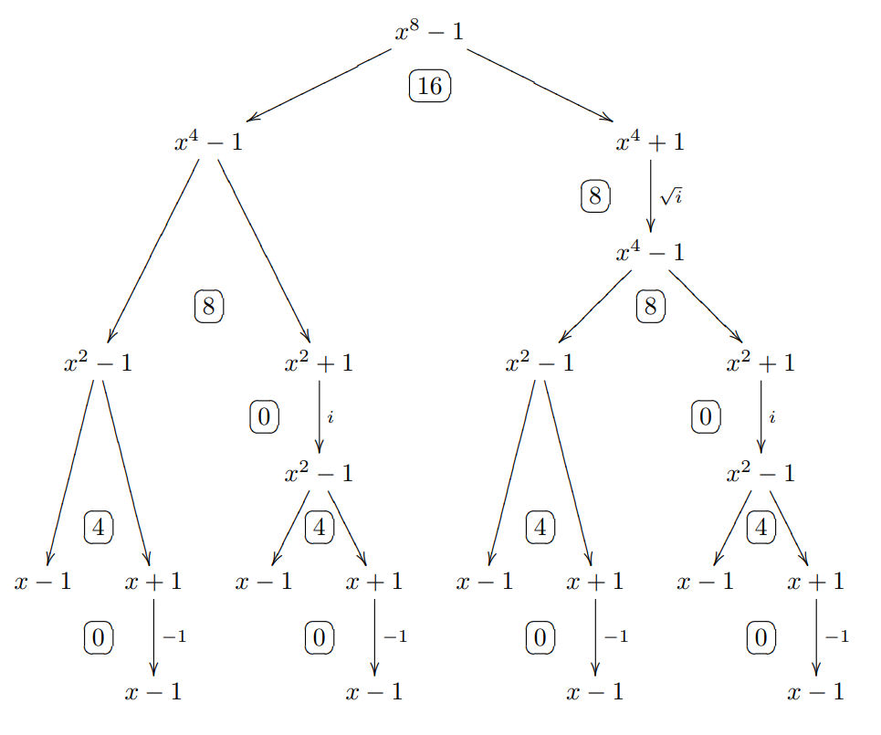
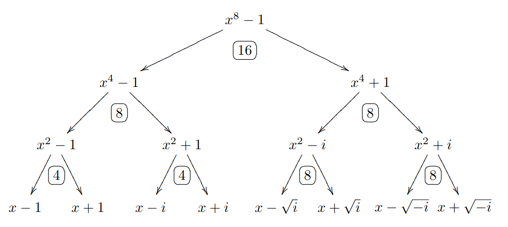

> Translated by ChatGPT.

The following is my intuitive understanding of FFT. It may not be rigorous; corrections are welcome if there are mistakes.

## FFT

The algorithm discussed below is the Cooley-Tukey FFT, which is more widely used in competitive programming.

Prerequisite: complex numbers, and an understanding of Euler's formula.

### Polynomial multiplication

For degree-$n$ polynomials

$$
\begin{aligned}
f(x) = \sum_{i=0}^n f_ix^i &=  f_0 + f_1 x + f_2x^2 + \cdots + g_nx^n \\
g(x) = \sum_{i=0}^n g_ix^i &=  g_0 + g_1 x + g_2x^2 + \cdots + g_nx^n
\end{aligned}
$$

Their convolution is $F(x) = f(x) \ast g(x) = (f \ast g)(x) = \sum\limits_{k=0}^{2n} c_kx^k$, where

$$
c_k = \sum_{i+j=k}f_ig_j
$$

So a naive polynomial convolution needs $n^2$ coefficient multiplications, and we need to optimize it.

### Point-value representation

A degree-$n$ polynomial $f(x)$ can be determined by $n+1$ coefficients, and it can also be determined by $n+1$ coordinates (point values). In other words, a degree-$n$ polynomial can be viewed as an $(n+1)$-dimensional vector.

Consider choosing $2n+1$ coordinates to determine $f(x)$ and $g(x)$. Then $F(x)$ can be obtained simply by doing $2n+1$ multiplications:

$$
(x_k,F(x_k)) = \left(x_k, f(x_k)g(x_k)\right)
$$

Now we have a new idea: first convert from coefficient representation to point-value representation, do the multiplication, and then convert back.

### DFT

How do we convert a polynomial into point values? We have the discrete Fourier transform.

The $n$ solutions to the equation $x^n = 1$ are called the $n$-th roots of unity $\zeta_n$. For a given polynomial $f(x) = \sum\limits_{k=0}^{n-1} f_kx^k$ and a root of unity $\zeta_n$, define the vector

$$
\operatorname{DFT}_{\zeta_n}(f) =( f(1), f(\zeta_n^1), \cdots, f(\zeta_n^{n-1}) )
$$

as the discrete Fourier transform of $f$.

DFT has an inverse transform (IDFT), which converts point values back into coefficients. It is still a vector-to-vector transform.

IDFT has a key property:

$$
(\operatorname{DFT}_{\zeta})^{-1} = \frac{1}{n} (\operatorname{DFT}_{{\zeta}^{-1}}) \tag{1}
$$

We will prove it later. For now, we can handle DFT and IDFT uniformly.

For convenience, in the following we write $\operatorname{DFT}_{\zeta_n}$ simply as $\mathcal{F}_n$.

### Primitive root of unity

At this point, the complexity of computing DFT is still $O(n^2)$. The key step of FFT is to choose special points to speed up the computation.

One special root of unity is denoted $\zeta_n = e^{\frac{2 \pi i}{n}}$, called a primitive root of unity. By Euler's formula,

$$
\zeta_n = e^{\tfrac{2 \pi i}{n}} = \cos \left(\frac{2\pi}{n}\right) + i \sin \left(\frac{2\pi}{n}\right)
$$

That is, $\zeta_n$ is a point on the unit circle, and all $n$ roots of unity

$$
x_k = \zeta_n^k = e^{k\tfrac{2 \pi i}{n}} = \cos \left(\frac{2\pi k}{n}\right) + i \sin \left(\frac{2\pi k}{n}\right) 
$$

correspond exactly to the $n$ equally spaced points on the unit circle. Therefore, by Euler's formula, **multiplication among roots of unity is just rotating around the unit circle.**

It is not hard to verify several properties of the primitive root $\zeta_n$ using Euler's formula:

- $\zeta_{2n}^{2k} = \zeta_n^k$.
- $\zeta_{2n}^{n+k} = -\zeta_{2n}^k$.

### Divide and conquer

Using the special properties of primitive roots of unity, we can compute DFT by divide and conquer. For example, for a degree-$7$ polynomial:

$$
\begin{aligned}
f(x) &= f_0 + f_1x + f_2x^2 + f_3 x^3 + f_4 x^4 + f_5 x^5 + f_6 x^6 + f_7 x^7 \\
&= (f_0 + f_2x^2 + f_4x^4 + f_6x^6) + x(f_1 + f_3x^2 + f_5x^4 + f_7x^6)
\end{aligned}
$$

Separate odd and even terms:

$$
\begin{aligned}
f^{[0]}(x) &= f_0 + f_2x + f_4x^2 + f_6x^3 \\
f^{[1]}(x) &= f_1 + f_3x + f_5x^2 + f_7x^3
\end{aligned}
$$

Then the original function can be written as

$$
f(x) = f^{[0]}(x^2) + xf^{[1]}(x^2)
$$

In general, for a polynomial $f(x)$ of degree less than $n$, its value at the root of unity $x = \zeta_n^k$ is

$$
\begin{aligned}
f(\zeta_n^k) &= f^{[0]}(\zeta_n^k \cdot \zeta_n^k) + \zeta_n^kf^{[1]}(\zeta_n^k \cdot \zeta_n^k) \\
&= f^{[0]}(\zeta_n^{2k}) + \zeta_n^kf^{[1]}(\zeta_n^{2k}) \\
&= f^{[0]}(\zeta_{n/2}^{k}) + \zeta_n^kf^{[1]}(\zeta_{n/2}^{k})
\end{aligned}
$$

Similarly,

$$
\begin{aligned}
f(\zeta_n^{k+n/2}) &= f^{[0]}(\zeta_n^{2k+n}) + \zeta_n^{k+n/2}f^{[1]}(\zeta_n^{2k+n}) \\
&= f^{[0]}(\zeta_{n/2}^{k}) - \zeta_n^{k}f^{[1]}(\zeta_{n/2}^{k})
\end{aligned}
$$

In DFT form:

$$
\begin{aligned}
\mathcal{F}_n(f)[j] &= \mathcal{F}_{n/2}(f^{[0]})[j] + \zeta_n^j \mathcal{F}_{n/2}(f^{[1]})[j] \\
\mathcal{F}_n(f)[j + n/2] &= \mathcal{F}_{n/2}(f^{[0]})[j] - \zeta_n^j\mathcal{F}_{n/2}(f^{[1]})[j]
\end{aligned}
\tag{2}
$$

Therefore, we need to pad the number of polynomial coefficients up to $2^n$, which makes divide and conquer convenient.

Now we can write the recursive FFT.

```cpp
void fft(int n, img *f, int op) {
    static img tmp[1 << 18];
    if (n == 1)
        return;
    for (int i = 0; i < n; i++)
        tmp[i] = f[i];
    for (int i = 0; i < n; i++) {  // put even indices on the left, odd indices on the right
        if (i & 1)
            f[n / 2 + i / 2] = tmp[i];
        else
            f[i / 2] = tmp[i];
    }
    img *g = f, *h = f + n / 2;
    fft(n / 2, g, op), fft(n / 2, h, op);
    img w0 = {cos(2 * PI / n), sin(2 * PI * op / n)}, w = {1, 0};
    for (int k = 0; k < n / 2; k++) {
        tmp[k] = g[k] + w * h[k];
        tmp[k + n / 2] = g[k] - w * h[k];
        w = w * w0;
    }
    for (int i = 0; i < n; i++)
        f[i] = tmp[i];
}
```

### Butterfly transform

Recursive divide and conquer is never quite satisfactory. In the first few lines we are only doing recursive grouping, so we can consider doing it in one step.

Again take a degree-$7$ polynomial as an example:

- Initial: $\{x^0,x^1,x^2,x^3,x^4,x^5,x^6,x^7\}$
- Once: $\{x^0,x^2,x^4,x^6\},\{x^1,x^3,x^5,x^7\}$
- Twice: $\{x^0,x^4\},\{x^2,x^6\},\{x^1,x^5\},\{x^3,x^7\}$
- End: $\{x^0\},\{x^4\},\{x^2\},\{x^6\},\{x^1\},\{x^5\},\{x^3\},\{x^7\}$

Writing them in binary, we find that the binary representation at the end is exactly the reverse of the beginning.

| Initial    | 0    | 1    | 2    | 3    | 4    | 5    | 6    | 7    |
| :--------: | :--: | :--: | :--: | :--: | :--: | :--: | :--: | :--: |
| Initial(2) | 000  | 001  | 010  | 011  | 100  | 101  | 110  | 111  |
| End(2)     | 000  | 100  | 010  | 110  | 001  | 101  | 011  | 111  |
| End        | 0    | 4    | 2    | 6    | 1    | 5    | 3    | 7    |

This transform is called the butterfly transform, also known as the bit-reversal permutation.

We can preprocess the permutation array in $O(n)$. Let `R(x)` be the transformed result of $x$; then `R(x >> 1)` is already known. We just shift `R(x >> 1)` right by one and fill in the highest bit. The code is:

```cpp
void pre_rev(int lim) {
    int k = std::__lg(lim);
    rev.resize(lim);
    for (int i = 0; i < lim; ++i) {
        rev[i] = rev[i >> 1] >> 1;
        if (i & 1)
            rev[i] |= lim >> 1;
        // or write it in one line as
        // rev[i] = (rev[i >> 1] >> 1) | ((i & 1) << (k - 1));
    }
}
```

Now we can write the iterative FFT.

```cpp
void fft(img *f, int n, int op) { // DIT
    for (int i = 0; i < n; ++i)
        if (i < rev[i])
            swap(f[i], f[rev[i]]);
    for (int l = 1; l <= n / 2; l <<= 1) {
        img w0 = {cos(PI / l), sin(PI * op / l)};
        for (int i = 0; i < n; i += l * 2) {
            img w = {1, 0};
            for (int j = 0; j < l; j++) {
                img x = f[i + j], y = w * f[i + j + l];
                f[i + j] = x + y, f[i + j + l] = x - y;
                w = w * w0;
            }
        }
    }
    if (op == -1)
        for (int i = 0; i < n; i++)
            f[i] = f[i] / n;
}
```

## NTT

Prerequisite: elementary number theory (divisibility and congruence).

Using `double` to implement integer multiplication is inelegant, with issues in both precision and speed. In fact, we can do everything over integers.

### Primitive root

The two essential properties of the primitive root of unity $\zeta_n$ that we use are:

- $\zeta_{n}^{n} = 1$.
- $\zeta_{2n}^{n} = -1$.

This brings to mind the residue field $\mathbb{Z}_p$ modulo $p$: its elements are $\{0,1,\cdots,p-1\}$, and all operations on it are modulo $p$. By Fermat's little theorem,

$$
a^{\varphi(p)} = a^{p-1} \equiv 1
$$

In other words, the $p-1$ positive integers are all solutions of the congruence equation $x^{p-1} \equiv 1$.

This has a form very similar to roots of unity. Intuitively, $\mathbb{Z}_p$ should also contain special numbers similar to primitive roots of unity. Below we discuss this over $\mathbb{Z}_p$ and try to prove such a number exists.

Define the order $\delta_p(a)$ of a positive integer $a \in \mathbb{Z}_p$ as the smallest $r$ such that $a^r \equiv 1$. By Fermat's little theorem, $a^{\varphi(p)} \equiv 1$, so the order of $a$ must exist and satisfies $\delta_p(a) \mid \varphi(p)$. It can be proven that

$$
a,a^2,\cdots a^{\delta_p(a)} \tag{3}
$$

have pairwise distinct residues modulo $p$. By Lagrange's theorem, $x^{\delta_p(a)} \equiv 1$ has at most $\delta_p(a)$ solutions, exactly the ones shown in $(3)$.

From divisibility, only $i \bot \delta_p(a)$ gives $\delta_p(a^i) = \delta_p(a)$. That is, $a$ always brings along

$$
\sum_{i=1}^{\delta_p(a)} [\gcd(i, \delta_p(a)) = 1] = \varphi(\delta_p(a))
$$

elements with the same order. Therefore, there are exactly $\varphi(\delta_p(a))$ numbers of order $\delta_p(a)$.

Since every positive integer has a uniquely determined order, suppose that for every $d \mid \varphi(p)$, there exist $\varphi(d)$ corresponding integers of order $d$. Counting the integers gives

$$
\sum_{d \mid \varphi(p)} \varphi(d) = \varphi(p) = p - 1
$$

which is exactly the number of all positive integers in $\mathbb{Z}_p$. Therefore the assumption holds, and there exists an $a$ such that $\delta_p(a) = p-1$.

We call this $a$ a primitive root modulo $p$, usually denoted by $g$.

### Number Theoretic Transform

Extract as many factors of $2$ from $p - 1$ as possible:

$$
p = N q + 1, N = 2^m
$$

Let $g$ be a primitive root of $\mathbb{Z}_p$, and view $g_N \equiv g^q$ as the analogue of $\zeta_n$. Using quadratic residues, it is not hard to obtain $g_N^N \equiv 1$ and $g_N^{N/2} \equiv -1$.

Common examples are

$$
\begin{aligned}
p = 1004535809 = 479 \times 2^{21} + 1&, g = 3 \\
p = 998244353 = 7 \times 17 \times 2^{23} + 1&, g = 3
\end{aligned}
$$

Similarly, we can write the program:

```cpp
void ntt(ll *f, int n, int type) {
    for (int i = 0; i < n; ++i)
        if (i < rev[i])
            swap(f[i], f[rev[i]]);
    for (int h = 2; h < n; h <<= 1) {
        ll tg = type == 1 ? 3 : g_inv;
        ll gn = qpow(tg, (P - 1) / h);
        for (int j = 0; j < n; j += h) {
            ll g = 1;
            for (int k = j; k < j + h / 2; k++) {
                ll f1 = f[k], f2 = g * f[k + h / 2] % P;
                f[k] = (f1 + f2) % P;
                f[k + h / 2] = (f1 - f2 + P) % P;
                g = g * gn % P;
            }
        }
    }
    ll iv_n = qpow(n);
    if (type == -1)
        for (int i = 0; i < n; i++)
            f[i] = f[i] * iv_n % P;
}
```

At this point, you have learned FFT. Next we will study FFT more deeply from a mathematical perspective and fill in the theoretical foundation.

## Linear transform

DFT is a linear transform. In other words, it can be written as matrix multiplication:

$$
\begin{bmatrix}
    f(\zeta_n^0) \\ f(\zeta_n^1) \\ f(\zeta_n^2) \\ \vdots \\ f(\zeta_n^{n-1})
\end{bmatrix} = \begin{bmatrix}
    1 & 1 & 1 & \cdots & 1 \\
    1 & \zeta_n^1 & \zeta_n^2 & \cdots & \zeta_n^{n-1} \\
    1 & \zeta_n^2 & \zeta_n^4 & \cdots & \zeta_n^{2(n-1)} \\
    \vdots & \vdots & \vdots  & \ddots & \vdots \\
    1 & \zeta_n^{n-1} & \zeta_n^{2(n-1)} & \cdots & \zeta_n^{(n-1)^2}
\end{bmatrix}
\begin{bmatrix}
    f_0 \\ f_1 \\ f_2 \\ \vdots \\ f_{n-1}
\end{bmatrix} 
$$

Denote the middle $n$-order Vandermonde matrix by $V(\zeta_n) = (\zeta_n^{ij})$.

Directly computing the inverse of $V(\zeta_n)$ is hard, but it is easy to verify that the following is a diagonal matrix:

$$
V(\zeta_n) V(\zeta_n^{-1}) = (n[i = j]) = n I_n
$$

Thus the matrix corresponding to IDFT is $V^{-1}(\zeta_n) = \frac{1}{n} V(\zeta_n^{-1})$, proving equation $(1)$.

### Removing REV

Actually, the FFT and IFFT implemented above are not dual to each other; it is just the convolution theorem that makes IFFT exactly the inverse operation of FFT. More specifically, we implemented two DITs, so butterfly permutation is needed before computation.


The core of the computation lies in equation $(2)$, which can be written in matrix form:

$$
\begin{bmatrix}
O_1 \\ O_2
\end{bmatrix} = 
\begin{bmatrix}
1 & \zeta_n^{-j} \\
1 & -\zeta_n^{-j} 
\end{bmatrix} 
\begin{bmatrix}
I_1 \\ I_2
\end{bmatrix}
$$

Taking the inverse of the matrix gives

$$
\begin{bmatrix}
I_1 \\ I_2
\end{bmatrix} = \frac{1}{2} 
\begin{bmatrix}
1 & 1 \\
\zeta_n^{j} & -\zeta_n^{j} 
\end{bmatrix} 
\begin{bmatrix}
O_1 \\ O_2
\end{bmatrix} \tag{4}
$$

This gives DIF. Similarly, we can implement two DIFs as FFT; in that case the butterfly permutation is performed after computation.

```cpp
void fft(img *f, int n, int op) { // DIF
    for (int l = n / 2; l >= 1; l >>= 1) {
        img w0 = {cos(PI / l), sin(PI * op / l)};
        for (int i = 0; i < n; i += l * 2) {
            img w = {1, 0};
            for (int j = 0; j < l; j++) {
                img x = f[i + j], y = f[i + j + l];
                f[i + j] = x + y, f[i + j + l] = w * (x - y);
                w = w * w0;
            }
        }
    }
    for (int i = 0; i < n; ++i)
        if (i < rev[i])
            swap(f[i], f[rev[i]]);
    if (op == -1)
        for (int i = 0; i < n; i++)
            f[i] = f[i] / n;
}
```

It is easy to see that if we use DIF as FFT and DIT as IFFT, no butterfly permutation is needed.

```cpp
void fft(img *f, int n) {
    for (int l = n / 2; l >= 1; l >>= 1) {
        img w0 = {cos(PI / l), sin(PI / l)};
        for (int i = 0; i < n; i += l * 2) {
            img w = {1, 0};
            for (int j = 0; j < l; j++) {
                img x = f[i + j], y = f[i + j + l];
                f[i + j] = x + y, f[i + j + l] = w * (x - y);
                w = w * w0;
            }
        }
    }
}

void ifft(img *f, int n) {
    for (int l = 1; l <= n / 2; l <<= 1) {
        img w0 = img{cos(PI / l), sin(PI / l)}.conj();
        for (int i = 0; i < n; i += l * 2) {
            img w = {1, 0};
            for (int j = 0; j < l; j++) {
                img x = f[i + j], y = w * f[i + j + l];
                f[i + j] = x + y, f[i + j + l] = x - y;
                w = w * w0;
            }
        }
    }
    for (int i = 0; i < n; i++)
        f[i] = f[i] / n;
}
```

This is Twisted FFT.

### Another interpretation

Notice that

$$
f(x_0) = f \bmod (x - x_0)
$$

We can start from this and reexamine the algorithm from the perspective of modulo. Suppose $f$ can be decomposed as

$$
f = (x^n - r)(x^n + r)f_{0} + (x^n - r)f_{1} + (x^n + r)f_{2} + f_3
$$

Let

$$
\begin{aligned}
O_1 &= f \bmod (x^n + r) = -2r f_1 + f_3\\
O_2 &= f \bmod (x^n - r) = 2r f_2 + f_3
\end{aligned}
$$

Then

$$
f \bmod (x^{2n} - r^2) = \frac{O_2-O_1}{2r}x^n + \frac{O_2 + O_1}{2} = I_1 x^n + I_2
$$

Notice that in the code we do not compute $O_1$ directly. Instead, we multiply the $j$-th term by $\zeta_{2n}^j$, which is equivalent to computing $f(\zeta_{2n}x)$.

We can find that

$$
f(\zeta_{2n}x) \bmod (x^n-1) = f(\zeta_{2n}x) \bmod ((\zeta_{2n} x)^n - 1) = f(x) \bmod (x^n + 1)
$$

This diagram is not easy to understand. The Original FFT diagram below is easier, but the algorithm widely used today is Twisted FFT.



From the diagram, the FFT process is to push the polynomial from the root to the leaves, obtaining values at all roots of unity. After doing the operation, it pushes from the leaves back to the root.

### Original FFT

Of course, we can directly divide and conquer; this is Original FFT.



Due to space, this post will not expand on it.

### Preprocessing roots of unity

Recomputing the roots of unity every time is wasteful. We can preprocess them and then use them during computation.

```cpp
vector ROOT;

void init(int n) {
    static int lim = (ROOT = {{1, 0}}, 1);
    if (lim >= n)
        return;
    ROOT.resize(n);
    for (int l = lim; l < n; l *= 2) {
        img w = {cos(PI / l / 2), sin(PI / l / 2)};
        ROOT[l] = w;
        for (int i = 1; i < l; ++i)
            ROOT[i + l] = ROOT[i] * w;
    }
    lim = n;
}
```

### Other applications

FFT is essentially a tool for quickly computing convolution. In this article, I want to focus more on understanding the computation process of FFT.

FFT has many other applications, such as fast addition and wildcard pattern matching. Later, after solving more problems, I may write another post about them. For now, I have not accumulated enough.

## Refence

1. [OI-Wiki Fast Fourier Transform](https://oi-wiki.org/math/poly/fft/)
2. [FFT Introductory Notes - hly1024](https://loj.ac/d/3165)
