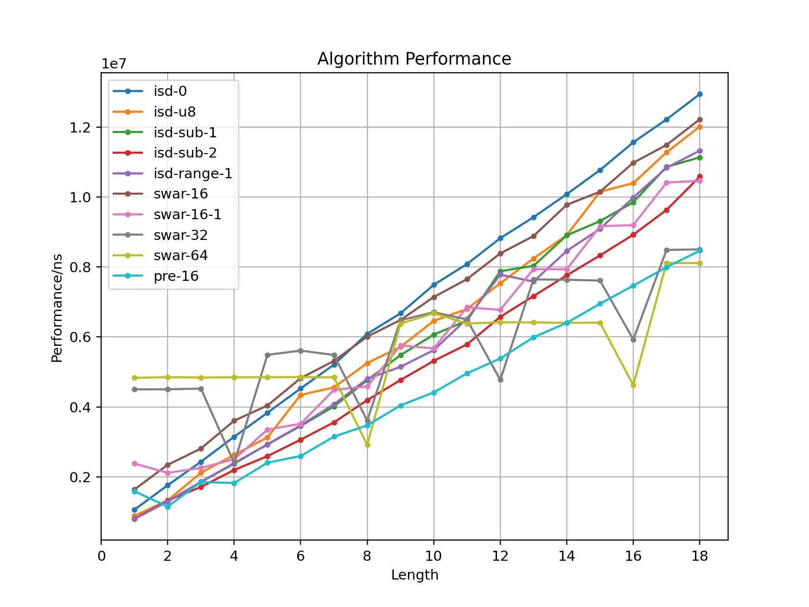

> Translated by ChatGPT.

Code repository: [github/bench-int-parse](https://github.com/rogeryoungh/bench-int-parse/tree/main).

> A small exercise in performance analysis.

This is what OIers/ACMers usually call fast input. This post tests an alternative fast input method that is easy to implement, and the result shows an improvement of around 50%.

Before starting, I make the following constraints on the problem:

- The input is a string like `0 123\n456 123456789`, containing only ASCII characters.
- The number range is $[0, 10^{18}]$, ignoring the `u64` boundary.
- In practice there is usually only one separator, but multiple separators should still be handled correctly.
- Tests are run under O2 or O3 optimization levels.
- Based on the input properties, specialize two algorithms:
  - Strict: the input contains ASCII characters.
  - Non-strict (TODO): only digit characters have values greater than `0x30`.

Next I will implement several variants and use the `nanobench` library for performance testing.

## Contestant 1: isdigit

The most common fast input implementations usually use `isdigit` or an equivalent `'0' <= c && c <= '9'`.

A typical fast input implementation looks like this:

```cpp
inline static u64 isd_0_getu(const char *&p) {
  char c = *p++;
  while (!std::isdigit(c))
    c = *p++;
  u64 x = c - '0';
  for (c = *p++; std::isdigit(c); c = *p++)
    x = x * 10 + c - '0';
  return x;
}
```

For the single-separator case, I also casually wrote an optimized version:

```cpp
inline static u64 isd_1_getu(const char *&p) {
  while (true) {
    char c = *p++;
    if (std::isdigit(c)) {
      u64 x = c - '0';
      for (c = *p++; std::isdigit(c); c = *p++)
        x = x * 10 + c - '0';
      return x;
    }
  }
}
```

There are also some "optimizations" floating around, and I tried implementing some of them:

- `isd-0`: `isdigit_0_getu` above
- `isd-1`: `isdigit_1_getu` above
- `isd-u8`: store `char` as `u8`
- `isd-m10`: write multiplication by 10 as `(c << 3) + (c << 1)`
- `isd-and`: write `c - '0'` as `c & 0xf`
- `isd-xor`: write `c - '0'` as `c ^ '0'`
- `isd-range`: write `isdigit` as `'0' <= c && c <= '9'`
- `isd-sub`: write `isdigit` as `u8(c - '0') <= 9`, which can save another subtraction later
- `isd-goto`: write the logic with `goto` instead of loops
- `isd-sub-1`: hybridize the faster variants above
- `isd-sub-2`: unroll the loop 20 times

### Performance test

See later for the exact test method. Here I only show the results under `gcc -O2` (unit: us).

| Algorithm/length | 1    | 2    | 4    | 8    | 12   | 16    |
| ---------------- | ---- | ---- | ---- | ---- | ---- | ----- |
| isd-0            | 1057 | 1757 | 3145 | 6086 | 8854 | 11569 |
| isd-1            | 1056 | 1638 | 3029 | 5917 | 8715 | 11452 |
| isd-u8           | 881  | 1322 | 2627 | 4948 | 7863 | 10403 |
| isd-m10          | 881  | 1322 | 2628 | 4963 | 7885 | 10404 |
| isd-and          | 924  | 1322 | 2633 | 5151 | 7942 | 10271 |
| isd-xor          | 1057 | 1499 | 3715 | 5630 | 8356 | 11253 |
| isd-range        | 881  | 1371 | 2393 | 4853 | 7162 | 9851  |
| isd-range-1      | 793  | 1295 | 2360 | 4811 | 7720 | 9978  |
| isd-sub          | 793  | 1410 | 2637 | 5145 | 7831 | 10637 |
| isd-goto         | 801  | 1453 | 2652 | 4749 | 8107 | 10639 |
| isd-sub-1        | 793  | 1293 | 2389 | 4768 | 7842 | 9791  |
| isd-sub-2        | 797  | 1321 | 2194 | 4198 | 6567 | 8923  |

From this we can draw a few conclusions:

- Performance is broadly similar, with small differences for short numbers.
- `isd-m10` and `isd-u8` generate exactly the same assembly.
  - The `lea` instruction is very powerful and can combine addition and multiplication. For example, `x * 10 + c - '0'` only needs two instructions.
- `isd-xor` may slightly hurt performance.
- For `isd-range`, the compiler optimizes the range check into a subtraction check, and uses `lea` instead of `sub` for the subtraction, giving a mysterious speedup.
- `isd-sub` seems to save one subtraction, but `movzbl` only loads into `eax`, so another instruction is still needed to extend to 64 bits. Locally, `and` is inexplicably faster.

Next I will keep only some representative variants for further testing.

## Contestant 2: SWAR (SIMD within a Register)

For example, the string `"42"` read as a `u16` is `0x3234` (little-endian by default), namely `0x0204`. We need an operation similar to `(x << 8) * 10 + x` to merge the high and low digits correctly.

After simplifying, this is multiplication by `0x0a01`. That is, `0x0204 * 0x0a01 = 0x142a04`, and the target value `0x2a = 42` is inside it. Similarly, we can design implementations for `u32`, `u64`, or even longer merges.

Recommended reading: [Faster Integer Parsing](https://kholdstare.github.io/technical/2020/05/26/faster-integer-parsing.html). The diagrams are very intuitive.

### Shorter than the word length

For strings shorter than the word length, we need another trick.

- Valid digits are only between `0x30` and `0x39`, so for digits only, `y = x & (x + 6)` still starts with `0x30`.
- Then `z = (y & 0xf0f0) ^ 0x3030` clears the digit bytes.
- With some bit-operation magic, `len = std::countl_zero(z) >> 3`.
- Finally use `u = x >> (16 - (len << 3))` to align the digits.

Also, `std::countl_zero` has an extra zero special case compared with the `ctz` instruction, and the compiler generates a fast path for it, causing a jump in the performance data. I handle it manually here.

In short, we can implement 16-, 32-, and 64-bit word lengths fairly easily. Here I only show the `u64` implementation.

```cpp
inline static u64 _swar_64(u64 u) {
  u = (u & 0x0f0f0f0f0f0f0f0f) * 0x0a01 >> 0x08;
  u = (u & 0x00ff00ff00ff00ff) * 0x00640001 >> 0x10;
  u = (u & 0x0000ffff0000ffff) * 0x271000000001 >> 0x20;
  return u;
}

inline static u64 swar_64_getu(const char *&p) {
  u64 x = 0;
  while (u8(*p - '0') > 9)
    p++;
  constexpr u32 p10[] = {1, 10, 100, 1000, 10000, 100000, 1000000, 10000000, 100000000};
  constexpr u64 cx30 = 0x3030303030303030;
  while (true) {
    u64 u = *reinterpret_cast<const u64 *>(p);
    u64 umask = u & (u + 0x0606060606060606) & 0xf0f0f0f0f0f0f0f0;
    if (umask == cx30) {
      p += 8;
      x = x * p10[8] + _swar_64(u);
    } else {
      u64 len = std::countr_zero(umask ^ cx30) >> 3;
      if (len != 0) {
        u <<= 64 - (len << 3);
        p += len;
        x = x * p10[len] + _swar_64(u);
      }
      break;
    }
  }
  p++;
  return x;
}
```

I also tried an AVX2 implementation, but because the multiplication width is not enough, the operation above is hard to vectorize. My crude implementation performed very poorly, so I will not embarrass myself by posting it.

## Contestant 3: lookup table

How could a performance comparison not include a lookup table?

Just preprocess a table from string `u16` to value, then handle boundary cases.

```cpp
template <class T>
T *_prepare_16_table() {
  constexpr u32 N = 0x10000;
  T *f = new T[N];
  std::memset(f, -1, N);
  for (u32 i = 0; i != 0x100; ++i) {
    for (u32 j = 0; j != 10; ++j) {
      u32 t = i * 0x100 | j | 0x30;
      if ('0' <= i && i <= '9')
        f[t] = j * 10 + i - 0x30;
      else
        f[t] = j | 0x100;
    }
  }
  return f;
}

inline u64 pre_16_getu(const char *&p) {
  static const auto *pre16 = _prepare_16_table<u16>();
  u8 c = *p++ - '0';
  while (c > 9)
    c = *p++ - '0';
  u64 x = c;
  while (true) {
    u16 t = *reinterpret_cast<const u16 *>(p);
    auto ft = pre16[t];
    p += 2;
    if (ft < 100) { // len = 2
      x = x * 100 + ft;
    } else { // len = 1
      if (ft < 0x1000)
        x = x * 10 + ft - 0x100;
      else
        --p;
      break;
    }
  }
  return x;
}
```

## Performance analysis

Test method: parse a string containing $2^{20}$ numbers, with loop unrolling disabled (nounroll).



We can draw the following conclusions:

- Using `isd-0` as the baseline, `sub-2` reaches about 122% efficiency, so there is still a noticeable improvement.
- The `swar` family performs very well for long numbers. For example, `swar-64` reaches 159% efficiency, and even 250% at len = 16. But at len = 1 it is only 21%, because the overhead for short numbers is too large.
- `pre-16` has a better constant factor, reaching about 152% efficiency for medium and long numbers.

In short, I choose `pre-16` as the final implementation.

## Afterword

Code repository: [github/bench-int-parse](https://github.com/rogeryoungh/bench-int-parse/tree/main).

One day, while doing routine constant optimization for NTT, I suddenly started doubting input efficiency. I looked up several references, and this post is the result.

Some random ideas I have not had time to think through:

- Maybe `sub-2` and `pre-16` can be hybridized again.
- It might be possible to read a `u64` at a time and use bit operations to simulate reading `u16` and `u32`, which may be faster than reading each time.
- It would be worth testing performance with loop unrolling enabled. The compiler may arrange instructions better and obtain lower latency.

## References

- [Faster Integer Parsing](https://kholdstare.github.io/technical/2020/05/26/faster-integer-parsing.html)
- [Translation: Faster Integer Parsing](https://weedge.github.io/post/simd/faster_integer_parsing/)
- [Parsing series of integers with SIMD](http://0x80.pl/articles/simd-parsing-int-sequences.html)
- [Parsing 8-bit integers quickly](https://lemire.me/blog/2023/11/28/parsing-8-bit-integers-quickly/)
